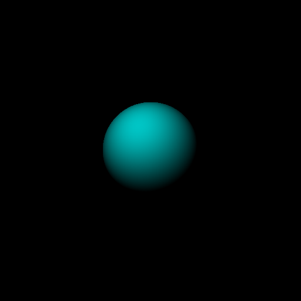
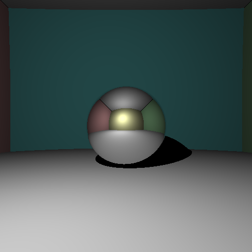
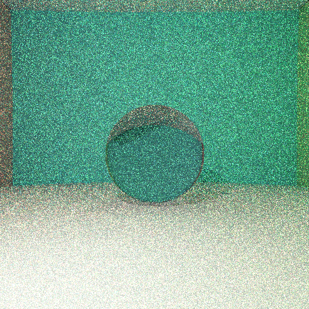
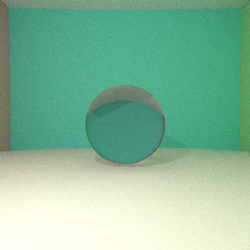
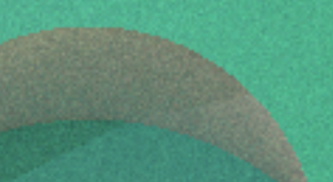
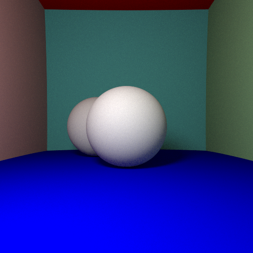
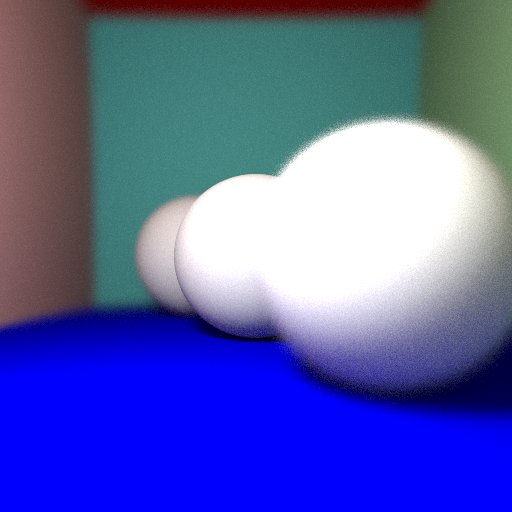
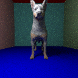
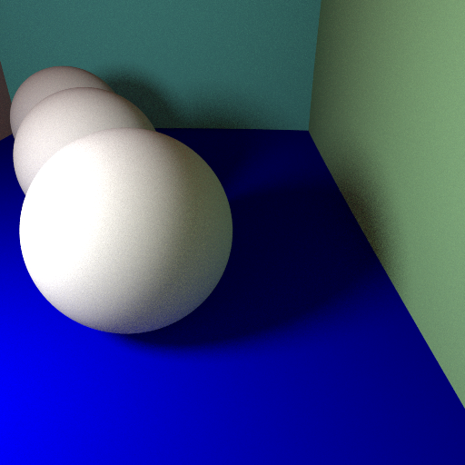
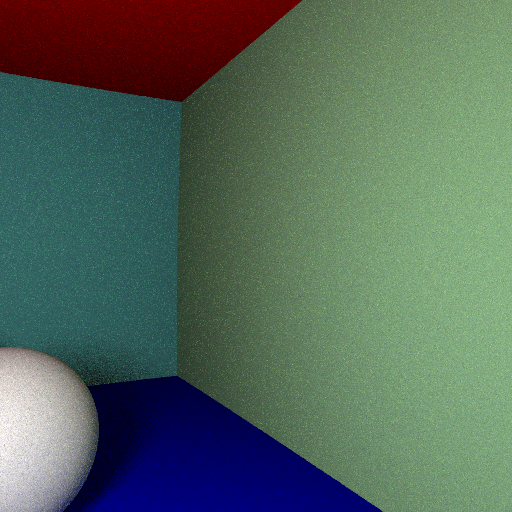

# MOS2.2_Informatique_Graphique

Projet de Ray tracing réalisé pendant le cours MOS 2.2 d'Infromatique Graphique à l'Ecole Centrale de Lyon

Enseignant : [Nicolas Bonnel](https://perso.liris.cnrs.fr/nicolas.bonneel/teaching.html)

## Table of Contents

 * [Description](#Description)
 * [Prerequis](#Prerequis)
 * [Utilisation](#Utilisation)
 * [Demarche](#Demarche)

## Description

## Prerequis

1. Nécessite un compileur C++ type g++ que l'on peut obtenir en installant [MinGW](https://sourceforge.net/projects/mingw-w64/)
2. Ajouter le chemin de mingW au variable d'envirronement windows (C:\MinGW\bin)
3. Les fichiers "stb_image.h" et "stb_image_write.h" était fourni avec le sujet et permettent de sauvegarder une image au foramt png.

## Utilisation

Ajuster les paramètre de la scene selon le résultat souhaité puis executé la commande suivante :

* Executer test.cpp avec openMP (Plus rapide, utilisation de tout les coeurs logiques de votre processeurs)
```sh
g++ -fopenmp test.cpp -o test
```

* Executer test.cpp sans openMP 
```sh
g++ test.cpp -o test
```

## Demarche

### Définition des premières classes
On commence par définir des classes de bases que l'on utilisera ensuite.

* La classe Vector : C'est un triplet de valeurs flottantes qui permet de caractériser un vecteur ou un point par ses coordonnées. C'est la structure de base que l'on utilisera dans notre travail en 3D. On ajoute une fonction permettant de normaliser le vecteur et on surcharge les opérateurs pour pouvoir réaliser les opérations usuelles sur des vecteurs. (addition, soustraction, multiplication avec un scalaire, multiplication terme à terme de 2 vecteurs, produit scalaire, produit vectoriel...)
* La classe Rayon : Définie par une origine et une direction (qui sont tout deux des Vectors). On l'utilisera pour modéliser le chemin de la lumière.
* La classe Sphere : Définie par son centre, son rayon et son albédo qui permet de déterminer sa couleur.
* La classe Scene : Définie la scène et son éclairage. On défini aussi une position et angle de caméra qui correspondent au point de vue de l'observateur (notre point de vue)

### Intersection Rayon Sphere
On commence par définir une fonction déterminant la présence d'une intersection rayon-Sphère.
On envoie un rayon par pixel de l'image et on détermine pour chaque sphère s'il y a une intersection. En cas d'intersection, on renvoie l'albédo de la dite Sphère.

Pour une Sphère unique rouge centrée dans notre image on obtient le résultat suivant, le drapeau du Japon en jouant un peu sur les couleurs :


### Modèle d'éclairage Lambertien

On ajoute maintenant une source lumineuse qui éclaire la Scène. Cela implique que l'exposition de la Sphère à la lumière varie en différents points.
On obtient le résultat suivant qui ajoute une impression de profondeur.



### Ombres portées
On remarque dans l'état actuel des choses qu'il n'y a pas d'ombres alors que notre sphère devrait en produire une.
On implémente cela en vérifiant si chaque rayon intersecte un objet avant d’atteindre la source lumineuse.

On ajoute ensuite des murs à la Scène pour délimiter l'espace. On corrige aussi le comportement obtenu quand plusieurs boules sont ajoutées à la scène. En effet, le calcul d'intersection prend en compte l'ordre d'ajout des sphères à la scène et non pas la position. Il faut donc déterminer pour chaque rayon quelle sphère est la plus proche et ne considérer que celle-ci.

### Correction Gamma
Cette partie est un petit aparté visant à corriger la couleur affichée par notre écran. En effet, les écrans appliquent lors de l'affichage une correction gamma visant à s'adapter à la perception des yeux humains. On corrige cela en appliquant une puissance en 1/2.2 à chaque pixel de l'image obtenue.

### Surfaces spéculaires et transparentes
On ajoute des attributs à nos Sphère ce qui permet de leur donner un comportement transparent ou spéculaire (de miroir).
Lors de l'intersection d'un rayon avec une sphère, un nouveau rayon est réfléchit ou réfracté en fonction du type de comportement choisis.

Voici le résultat combinant l'implémentation d'une surface transparente, des ombres portées et de la correction gamma :



### Éclairage indirect

Pour améliorer le rendu, on va considérer l'éclairage indirect (réflections lumineuses). Un rayon rebondit désormais plusieurs fois, la couleur de chaque pixel est déterminée à l'issue des différents rebonds. On obtient des résultats très bruités, car on envoie à chaque fois un rayon unique sur notre scène.
On utilise donc plusieurs rayons rebondissant de manière aléatoire et on moyenne les couleurs obtenues.
En utilisant, 100 ou 500 rayons, on obtient des résultats plus lisse mais aussi beaucoup plus long à générer. Le temps de calcul augmente à peu près linéairement en fonction du nombre de rayons donc le résultat peut être très long à obtenir.

Voici le résultat obtenu pour 1, 50 et 100 rayons sur une scène contenant une sphère transparente :




### Anti-aliasing

Le rayon utilisé est toujours tiré depuis le centre du pixel, les bordures des objets présentent alors un crénelage à leur interface.



Pour éviter ce problème, on déplace légèrement chaque rayon aléatoirement autour du centre du pixel. Le résultat moyenné lisse les bordures qui sont légèrement floues ce qui masque les crénelures.

### Ombres douces
Jusqu’à présent, on avait utilisé une lumière ponctuelle ce qui créait des ombres très franches.
On remplace cette source par une sphère du même type que les objets de notre Scène.
Cela nous permet d'obtenir des ombres plus douces comme dans l'exemple suivant :

Logiquement, on obtient des ombres de plus en plus douces quand la taille de la Sphère augmente.
Le temps de calcul augmente à nouveau fortement en fonction de la taille de la source lumineuse.

Voici un exemple d'ombres douces sur 2 sphères dans notre scène ayant aussi implémenté l'anticrénelage.


### Profondeur de champs

On souhaite se rapprocher du rendu d'un appareil photo qui ne fait le focus que sur un des plans de la scène.
On réalise cela en ajoutant une focale à notre caméra qui dévie les rayons pour obtenir un focus sur un certains plan de l'image.

On obtient un résultat très convaincant qui pourrait encore s'améliorer en multipliant le nombre de rayons, mais le temps de calcul devient trop important.



### Maillage 

On souhaite maintenant ajouter des formes complexes à notre scène. On utilise des fichiers OBJ représentant le maillage.
Les modèles 3D sont décrits par un ensemble de sommets et de triangles. On modifie notre routine d'intersection pour qu'elle évalue les intersections d'un rayon avec un triangle du modèle 3D. Pour améliorer les performances, on génère aussi une boite englobante autour de notre modèle. Pour les rayons qui n'intersectent pas avec la boite englobante, on ne calcule pas l'intersection avec le maillage 3D.

Cette étape devient limitante en terme de performance pour mon ordinateur qui met beaucoup de temps à générer une image avec un nombre de rayons suffisant.
### Textures
On ajoute ensuite des textures à notre modèle 3D. Cela permet d'ajouter les couleurs de la surface du modèle.

Voici le résultat obtenu pour le modèle de chien intégré à notre scène :




### BVH (Bounding Volume Hierarchy)

On améliore les performances en utilisant le principe de bounding box hierarchy. On cherche ici à itérer sur les boites englobantes de notre modèle de façon récursive jusqu'à obtenir de boites contenant seulement quelques triangles. On réduit à nouveau le nombre d'intersections avec le maillage à calculer ce qui réduit le temps de calcul général.

### Mouvement de Camera

La dernière implémentation vise à contrôler la position de la caméra.
Pour se faire, il suffit de modifier un peu la direction des rayons projetés.

On pourrait ainsi réaliser une animation en générant de multiple photos avec une direction des rayons variants. Ramené à 30 images par seconde, le résultat devrait être convaincant.
Cependant, le temps de calcul sera très conséquent et j'ai donc abandonné cette idée et simplement réaliser quelques mouvements de caméra.

Rotation selon x: 



Rotation selon z:



### Conclusion

J'ai trouvé ce cours globalement intéressant mais difficile à suivre pour plusieurs raisons. 
Tout d'abord, le planning de 3A est assez chargé et le temps nécessaire pour obtenir des résultats vraiment très sympa est assez long. 
Ensuite, je trouve qu'il faudrait insister plus fortement en amont sur le niveau de C++ attendu, j'avais personnellement très peu utilisé ce langage auparavant donc le cumul de l'apprentissage du langage et du contenu technique ont rendu le projet difficile. 
Enfin, vous laissiez le choix sur l'IDE ou sur le langage et je pense vraiment que vous devriez fortement recommander Visual Studio et C++ (ce que vous utilisez). En effet, l'étudiant qui a fait le projet en java a passé un temps très important à juste adapter des routines ou codes dont il ne disposait pas (lecture de fichier OBJ par exemple) et c'est assez dommage car ce n'est pas du tout la partie intéressante du cours. 
Pour ma part, j'ai utilisé Visual Studio Code, car j'ai l'habitude de cet IDE, mais il s'avère qu'il est très peu adapté à C++, ça n'a pas posé de problème au début, mais dès lors que les maillages sont arrivées, j'ai eu de nombreuses difficultés avec Openmp et le débogage qui est difficilement réalisable sur VScode.

Enfin, l'idée d'utiliser un repository Github est très pertinente pour le suivi des versions et je pense que vous devriez insister encore plus sur ce point. (initialisation du repository dès la première séance, ..)

Pour conclure, je trouve que ce cours aurait pu être très intéressant et stimulant mais finalement j'ai trop été dérangé par les problèmes techniques et je suis finalement un peu déçu du résultat obtenu par rapport au temps consacré. 
Je conseillerais volontiers ce cours à d'autres étudiants, mais en insistant très fortement sur l'IDE à utiliser, le langage à utiliser et le versioning Github. Cela permettra d'éviter la majorité des problèmes techniques qui font perdre du temps sur le cœur très intéressant du sujet.
